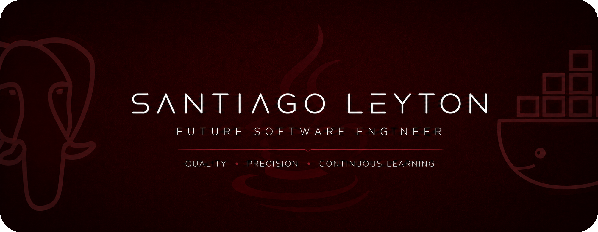

 

<h2 align="center">About Me</h2>

I'm Santiago Leyton, a Software Engineering student who enjoys turning ideas into complete software solutions.

Throughout my academic journey I have developed desktop applications, web platforms, management systems and educational software, allowing me to strengthen my backend development, database design and software architecture skills.

I believe good software is not measured only by functionality, but by code quality, maintainability and continuous improvement. Every project I build is an opportunity to become a better engineer.

---

<h2 align="center">Currently</h2>

- 🎓 Studying **Software Engineering** at **CUE Alexander von Humboldt**
- ☕ Deepening my knowledge in **Java**, **Spring Boot** and backend development
- ⚛️ Building modern web applications with **React** and **Next.js**
- 🐘 Improving my **PostgreSQL** database design skills
- 🐳 Exploring **Docker** and deployment workflows
- 📚 Continuously studying software architecture and clean code

---

<h2 align="center">Technology Stack</h2>

### Languages

 

### Backend

 

### Frontend

 

### Database

 

### Desktop Development

 

### Tools

---

<h2 align="center">Featured Projects</h2>

| Project | Description |
|---------|-------------|
| **Ágora** | Educational simulator developed for Psychology students using Spring Boot, React, Next.js and PostgreSQL. |
| **Bonga Shop** | Complete e-commerce platform with inventory, products, orders and administrative management. |
| **ParkingAXM** | Desktop parking management system developed with JavaFX including statistics and reporting. |
| **Memorias del Parque** | Educational pixel-art video game inspired by the Colombian Coffee Cultural Landscape. |

---

<h2 align="center">Connect With Me</h2>

• 😺 **Professional GitHub:** <a href="https://github.com/IngSantiagoLeyton">IngSantiagoLeyton</a> 

• 💼 **LinkedIn Profile:** <a href="https://linkedin.com/in/TU-USUARIO">LinkedIn</a>
