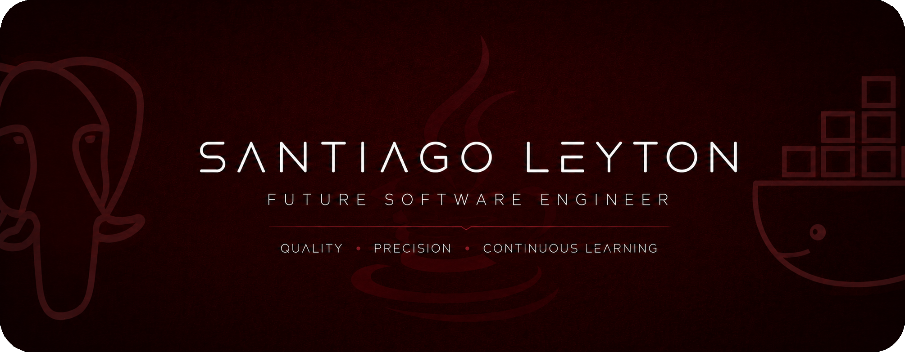
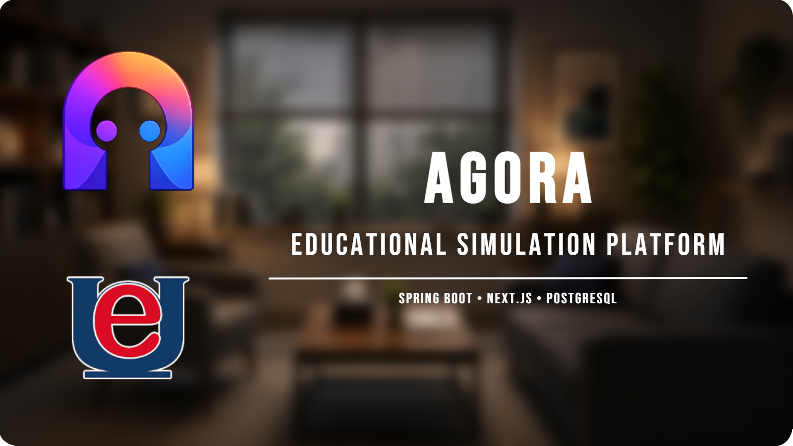
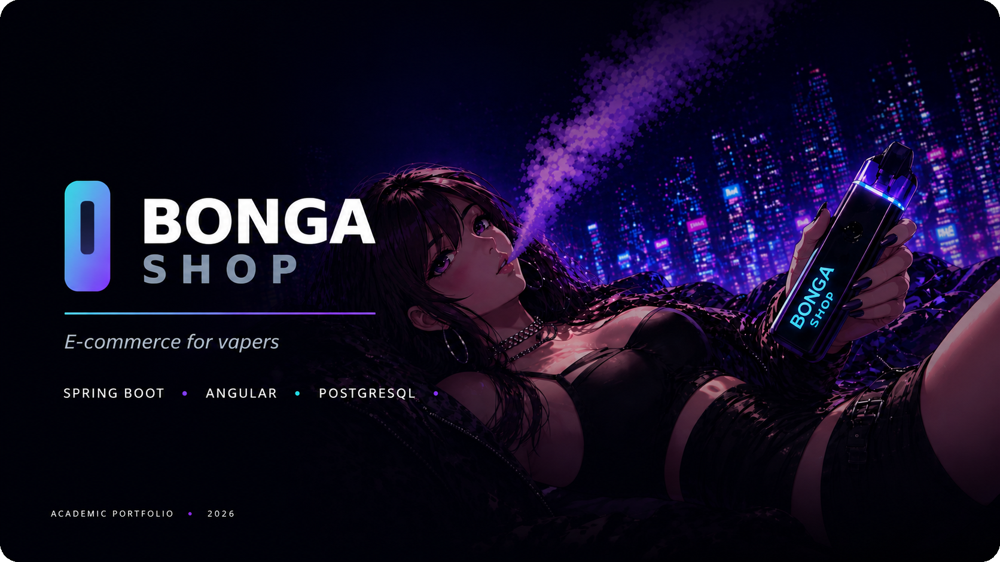
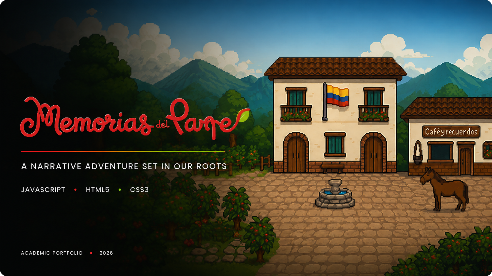

  

 

<h1 align="center">Hi, I'm Santiago Leyton 👋</h1>

Software Engineering Student • Backend Developer • Process Automation Enthusiast

---

# About Me

I'm a Software Engineering student passionate about building software that solves real-world problems through clean architecture, scalable backend development and business process automation.

My experience ranges from educational platforms and enterprise applications to desktop software and automation tools. I enjoy transforming ideas into polished, maintainable and user-centered solutions while continuously improving my engineering skills.

---

# Featured Projects

<table>
<tr>

<td width="58%" valign="middle">

</td>

<td width="42%" valign="middle">

<h2 align="center">Ágora</h2>

Educational simulation platform developed for the Faculty of Psychology to support Social Psychology training through realistic scenarios and structured educational feedback.

I designed and developed the backend architecture, business logic, database model, REST API, frontend integration and functional testing, ensuring a scalable and maintainable application.

<a href="https://github.com/SantiagoLeyton/Agora"><strong>View repository</strong></a>

</td>

</tr>

<tr>

<td colspan="2" align="center">

<strong>Spring Boot</strong>
&nbsp;&nbsp;•&nbsp;&nbsp;
<strong>Next.js</strong>
&nbsp;&nbsp;•&nbsp;&nbsp;
<strong>PostgreSQL</strong>
&nbsp;&nbsp;•&nbsp;&nbsp;
<strong>Docker</strong>
&nbsp;&nbsp;•&nbsp;&nbsp;
<strong>JWT</strong>
&nbsp;&nbsp;•&nbsp;&nbsp;
<strong>TypeScript</strong>

</td>

</tr>
</table>

---

<table>
<tr>

<td width="42%" valign="middle">

<h2 align="center">Bonga Shop</h2>

Full Stack e-commerce platform designed for managing products, variants, inventory, favorites, shopping carts, orders and administrative operations.

I developed the complete backend, including authentication, business logic, database integration and REST APIs. I also connected the backend with the frontend and implemented AI-assisted features for customer recommendations and operational suggestions for administrators.

<a href="https://github.com/SantiagoLeyton/BONGA-SHOP"><strong>View repository</strong></a>

</td>

<td width="58%" valign="middle">

</td>

</tr>

<tr>

<td colspan="2" align="center">

<strong>Java</strong>
&nbsp;&nbsp;•&nbsp;&nbsp;
<strong>Spring Boot</strong>
&nbsp;&nbsp;•&nbsp;&nbsp;
<strong>Angular</strong>
&nbsp;&nbsp;•&nbsp;&nbsp;
<strong>TypeScript</strong>
&nbsp;&nbsp;•&nbsp;&nbsp;
<strong>PostgreSQL</strong>
&nbsp;&nbsp;•&nbsp;&nbsp;
<strong>Docker</strong>
&nbsp;&nbsp;•&nbsp;&nbsp;
<strong>Git</strong>

</td>

</tr>
</table>

---

<table>
<tr>

<td width="58%" valign="middle">

</td>

<td width="42%" valign="middle">

<h2 align="center">Memorias del Parque</h2>

Educational 2D game inspired by the Colombian Coffee Cultural Landscape, combining interactive storytelling, exploration and cultural learning through a journey based on recovering lost memories.

I independently developed the complete game, including its maps, characters, objects, animations, gameplay logic, interactions and narrative progression. I also contributed visual improvements to the accompanying informational website.

<a href="https://github.com/Mariana44-max/MemoriasDelParque"><strong>View repository</strong></a>

</td>

</tr>

<tr>

<td colspan="2" align="center">

<strong>JavaScript</strong>
&nbsp;&nbsp;•&nbsp;&nbsp;
<strong>HTML5</strong>
&nbsp;&nbsp;•&nbsp;&nbsp;
<strong>CSS3</strong>

</td>

</tr>
</table>

---

<table>
<tr>

<td width="42%" valign="middle">

<h2 align="center">Parking AXM</h2>

Desktop management system created to support the daily operation of a car and motorcycle parking facility, including vehicle registration, payment processing, user administration and operational reporting.

I developed the statistics module, including summary indicators, charts, date and vehicle-type filters, a usage heat map and PDF report export functionality.

<a href="https://github.com/SantiagoLeyton/ParkingAXM"><strong>View repository</strong></a>

</td>

<td width="58%" valign="middle">

</td>

</tr>

<tr>

<td colspan="2" align="center">

<strong>Java</strong>
&nbsp;&nbsp;•&nbsp;&nbsp;
<strong>JavaFX</strong>
&nbsp;&nbsp;•&nbsp;&nbsp;
<strong>Maven</strong>
&nbsp;&nbsp;•&nbsp;&nbsp;
<strong>ControlsFX</strong>
&nbsp;&nbsp;•&nbsp;&nbsp;
<strong>TilesFX</strong>
&nbsp;&nbsp;•&nbsp;&nbsp;
<strong>Gson</strong>

</td>

</tr>
</table>

---

<h2 align="center">Technology Stack</h2>

### Languages

 

### Backend

 

### Frontend

 

### Database

 

### Desktop Development

 

### Tools

---

<h2 align="center">Currently</h2>

- 💼 Completing my Software Engineering internship in enterprise software development
- ☕ Deepening my knowledge in **Java**, **Spring Boot** and backend development
- ⚛️ Building modern web applications with **React** and **Next.js**
- 🐘 Improving my **PostgreSQL** database design skills
- 🐳 Exploring **Docker** and deployment workflows
- 📚 Continuously studying software architecture and clean code

---

# Academic Journey

**Software Engineering**

<a href="https://unihumboldt.edu.co/">CUE Alexander von Humboldt</a>

**Expected Graduation:** 2028
